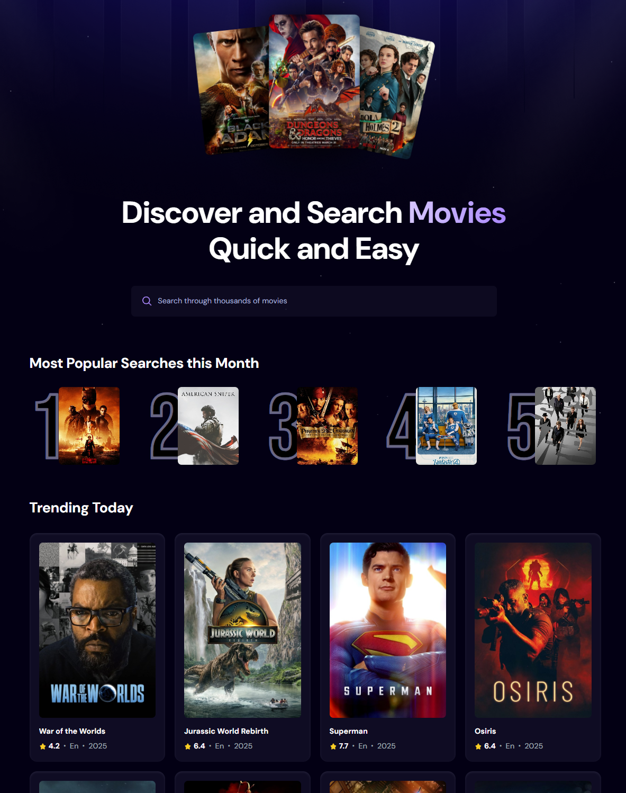

## Introduction

Built with React and styled using Tailwind CSS, this web app lets users browse trending movies, search titles, and explore details sourced from the TMDB API. The frontend is a Vite-based SPA; the backend runs as a Cloudflare Worker that connects to an existing MySQL database and proxies TMDB queries. Responsive layout and straightforward UX for quick evaluation.

## Preview

 

 
## Live Demo

## Tech Stack

- **[Cloudflare Workers](https://developers.cloudflare.com/workers/)** provides a lightweight, serverless environment for building and deploying backend logic close to users. In this project, the Worker acts as the API layer, connecting to MySQL through Hyperdrive and proxying requests to the TMDB API.

- **[MySQL](https://www.mysql.com/)** is a widely used relational database management system. It stores application metrics and search data, enabling persistent tracking of user queries.

- **[TMDB API](https://developer.themoviedb.org/)** is an external movie database API used to fetch movie details, trending data, and search results that populate the application.

- **[React.js](https://react.dev/reference/react)** is a JavaScript library developed by Meta for building user interfaces. It allows developers to create reusable UI components that manage their own state, leading to efficient and predictable code. React is widely used for developing single-page applications (SPAs) due to its virtual DOM that improves performance and maintainability.

- **[React-use](https://github.com/streamich/react-use)** is a collection of essential React hooks that simplify common tasks like managing state, side effects, and lifecycle events, promoting cleaner and more maintainable code in React applications.

- **[Tailwind CSS](https://tailwindcss.com/)** is a utility-first CSS framework that provides low-level utility classes to build custom designs without writing custom CSS, enabling rapid and responsive UI development.

- **[Vite](https://vite.dev/)** is a modern build tool that provides a fast development environment for frontend projects. It offers features like hot module replacement (HMR) and optimized builds, enhancing the development experience and performance.

## Features

- **Browse Trending Movies**: View the latest trending titles retrieved from TMDB using popularity metrics.

- **Search Movies**: Look up specific titles through TMDB and see results rendered directly in the interface.

- **Popular Searches Algorithm**: Highlights the most frequently queried movies of the month, derived from the app’s search history.

- **Modern, Responsive UI**: A component-driven design that scales seamlessly across different screen sizes.

- **Lightweight Architecture**: Frontend delivered as a single-page application; backend handled by a streamlined Worker for minimal overhead.
